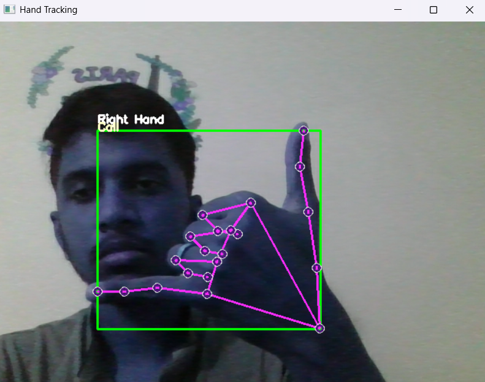

# KNN, SVM, LSTM, GRU WITH ENSEMBLE

This project explores and compares machine learning and deep learning techniques (KNN, SVM, LSTM, and GRU) for hand gesture recognition using a combination of Mediapipe and custom ensemble modeling. The goal is to create a robust system for real-time hand gesture recognition.

---

## Table of Contents

1. [Overview](#overview)
2. [Key Features](#key-features)
3. [Dependencies](#dependencies)
4. [Project Workflow](#project-workflow)
5. [Usage Instructions](#usage-instructions)
6. [Outputs](#outputs)
7. [Acknowledgments](#acknowledgments)

---

## Overview

This project implements an ensemble system for gesture recognition using:
- **KNN**: A simple k-nearest neighbors classifier.
- **SVM**: Support Vector Machines for classification.
- **LSTM** and **GRU**: Deep learning techniques for sequence learning.
- **Ensemble Learning**: Combines predictions from all models for more robust outcomes.

---

## Key Features

- **Gesture Dataset Creation**: Utilizes Mediapipe for hand tracking and landmark extraction.
- **Feature Engineering**: Pre-processes hand landmarks for use in models.
- **Model Training**: Implements separate training for KNN, SVM, LSTM, and GRU models.
- **Real-Time Prediction**: Captures gestures via webcam and provides real-time classification using ensemble modeling.
- **Visualization**: Includes scatter plots and confusion matrices for understanding model performance.

---

## Dependencies

The project relies on the following Python libraries:

```python
import csv
import copy
import argparse
import itertools
from collections import Counter, deque
import pandas as pd
import cv2
import seaborn as sns
import numpy as np
import mediapipe as mp
import time
from matplotlib import pyplot as plt
from sklearn import svm
from sklearn.model_selection import train_test_split
from sklearn.neighbors import KNeighborsClassifier
from sklearn.preprocessing import MinMaxScaler
from sklearn.metrics import classification_report, mean_squared_error, accuracy_score, confusion_matrix
from tensorflow.keras.models import Sequential, load_model
from tensorflow.keras.layers import Dense, LSTM, Dropout, GRU, Bidirectional, Input, Conv1D, MaxPooling1D, Flatten
from tensorflow.keras.optimizers import Adam
from tensorflow.keras.callbacks import ModelCheckpoint
from keras.utils import to_categorical
```

Make sure to install these packages using `pip install` before running the notebook.

---

## Project Workflow

1. **Dataset Collection**:
   - Uses Mediapipe to capture hand landmarks from webcam input.
   - Saves the processed landmark data into a CSV file.

2. **Model Training**:
   - **KNN**: Implements a k-nearest neighbors classifier for gesture recognition.
   - **SVM**: Trains a Support Vector Machine for gesture classification.
   - **LSTM & GRU**: Uses sequential neural networks for feature learning.

3. **Evaluation**:
   - Evaluates each model individually using metrics like accuracy, classification report, and confusion matrix.

4. **Real-Time Prediction**:
   - Captures real-time hand gestures via webcam.
   - Performs ensemble predictions using all models.

---

## Usage Instructions

1. **Setup**:
   - Install the dependencies mentioned in the [Dependencies](#dependencies) section.
   - Ensure a webcam is connected to your system.

2. **Run the Notebook**:
   - Execute the notebook step by step:
     1. Collect training data using the webcam.
     2. Train KNN, SVM, LSTM, and GRU models.
     3. Evaluate models and perform real-time predictions.

3. **Real-Time Gesture Recognition**:
   - Use the real-time prediction section to capture gestures and classify them.

---

## Outputs

- **Plots**: Scatter plots of the dataset and confusion matrices for model evaluations.
- **Accuracy Metrics**: Displays accuracy scores for each model.
- **Real-Time Predictions**:
  - Shows recognized gestures for KNN, SVM, LSTM, GRU, and ensemble prediction.
  - Calculates average recognition time for each model.

---
## Results
### Below are the results from our project in real time prediction
### Alphabet_B


### Alphabet_C


### Call


### Love


### Peace


---

## Acknowledgments

- This project utilizes **Mediapipe** for hand tracking and landmark extraction.
- Deep learning frameworks are implemented using **TensorFlow/Keras**.
- Visualization support is provided by **Matplotlib** and **Seaborn**.

## Below is the link for the google drive which consists of Dataset, Presentation slides, Report
 https://drive.google.com/drive/folders/1Rch6H8VpUjMYZ21Al97yRkWGSQSEhxH-?usp=drive_link

## Youtube link for Pre-Recorded Presentation Video
 https://youtu.be/BTmP-E0y5HI

## Youtube link for Demo video of our project output
 https://youtu.be/wq-Wd6EB9Yk 